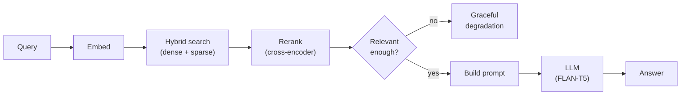
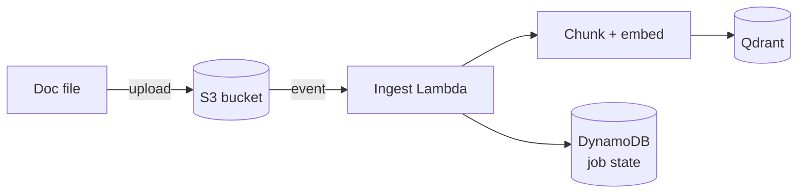
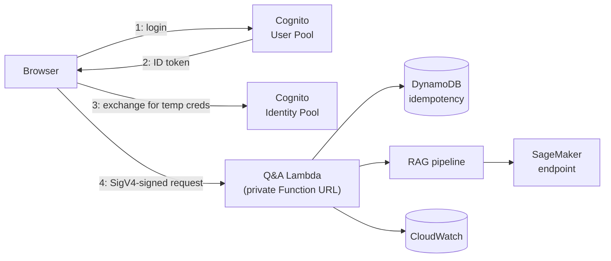

# RAG Chatbot — AWS Lambda & Serverless Q&A

A small RAG chatbot (Qdrant hybrid search + SageMaker JumpStart + Lambda), fully provisioned
with Terraform. The Q&A Lambda requires a signed-in user (Cognito login + SigV4) — no
anonymous or public access.

> **Qdrant note**: the free-tier cluster used during development returned 404s when last
> checked — consistent with a free cluster going idle/reclaimed after inactivity. Resume or
> recreate it in the Qdrant Cloud dashboard before relying on ingestion or local testing.

## 1. RAG architecture



- **Hybrid search**: dense embeddings (semantic meaning) + sparse BM25 (exact keywords/acronyms), fused in Qdrant via Reciprocal Rank Fusion.
- **Rerank**: a cross-encoder re-scores the top candidates for precision before they go in the prompt.
- **Relevance gate**: uses raw cosine similarity, not the fused score — the fused score doesn't cleanly separate relevant from irrelevant on a small corpus.
- **Three prompt templates** (`prompts.py`, versioned): grounded, weak-context, and self-correction — picked by relevance tier or by a "not satisfied" retry.

## 2. Knowledge base pipeline



- **Event-driven**: S3 fires the moment a file is added/changed/removed — no polling.
- **Incremental**: only the changed file's chunks are touched (filter-delete + re-upsert), not a full rebuild.
- **Idempotent**: deterministic chunk IDs (`uuid5`) make retries safe.
- **DynamoDB state**: per-file hash/status/chunk-progress — visibility into crashed runs, and unchanged files are skipped automatically.

## 3. Inference pipeline



- **Login required, no anonymous access**: a Cognito User Pool (username/password) is the only identity source federated into the Identity Pool (`allow_unauthenticated_identities = false`) — only a signed-in user's ID token can be exchanged for credentials, and those credentials are scoped to nothing but invoking this one function.
- **No public sign-up**: accounts are created by the project owner via the AWS CLI (see below), not a registration form.
- **Idempotent**: a client retry of the same `request_id` replays the cached response instead of re-billing SageMaker.
- **SageMaker is the only per-hour billed piece** in the whole system.
- Every request logs to CloudWatch and emits quality metrics (see below).

## Cost

| Resource | Cost |
|---|---|
| SageMaker (ml.g5.2xlarge) | ~$1.90/hr, billed until deleted |
| Everything else (Lambda, S3, ECR, Cognito, DynamoDB on-demand, CloudWatch, Qdrant free tier) | ~$0 |

## Running it

```bash
cd rag_chatbot && python3 -m venv .venv && source .venv/bin/activate && pip install -r requirements.txt
export AWS_REGION=eu-central-1 QDRANT_URL=... QDRANT_API_KEY=... QDRANT_COLLECTION_NAME=aws_lambda_docs
export TF_VAR_qdrant_url="$QDRANT_URL" TF_VAR_qdrant_api_key="$QDRANT_API_KEY"
python scripts/resolve_jumpstart_metadata.py
cd terraform && terraform init
```

Two-phase apply — free infra first (28 resources, verified via `terraform plan`), SageMaker
(~$1.90/hr) as an explicit second step:
```bash
terraform apply -target=aws_lambda_function_url.qa -target=aws_s3_bucket_notification.docs \
  -target=aws_cloudwatch_dashboard.this -target=aws_iam_role_policy.qa_lambda \
  -target=aws_iam_role_policy.ingest_lambda -target=aws_iam_role_policy.cognito_authenticated \
  -target=aws_s3_bucket_versioning.docs -target=aws_s3_bucket_public_access_block.docs \
  -target=aws_s3_object.docs -target=aws_cognito_identity_pool_roles_attachment.this \
  -target=aws_dynamodb_table.ingestion_state -target=aws_dynamodb_table.inference_idempotency
terraform apply   # SageMaker endpoint -- real money starts here
```

**Create your login** (no public sign-up — this is the one-time setup for yourself). Pick your
own username/password at the prompts below — don't commit real credentials to this repo:
```bash
POOL_ID=$(terraform output -raw cognito_user_pool_id)
read -rp "Username: " CHATBOT_USERNAME
read -rsp "Password (min 8 chars, upper/lower/number/symbol): " CHATBOT_PASSWORD; echo

aws cognito-idp admin-create-user --user-pool-id "$POOL_ID" --username "$CHATBOT_USERNAME" \
  --message-action SUPPRESS --region eu-central-1
aws cognito-idp admin-set-user-password --user-pool-id "$POOL_ID" --username "$CHATBOT_USERNAME" \
  --password "$CHATBOT_PASSWORD" --permanent --region eu-central-1
unset CHATBOT_PASSWORD
```

**Inference (no container)**: `python scripts/test_rag_local.py "What is a Lambda function URL?"`

**UI**: `cd frontend && python -m http.server 8000`, then paste `terraform output qa_function_url`,
`terraform output cognito_user_pool_id`, `terraform output cognito_user_pool_client_id`, and
`terraform output cognito_identity_pool_id` into the page, then sign in with the account above.

**Teardown** (do this when done — the only thing still billing):
```bash
terraform destroy -target=aws_sagemaker_endpoint.this \
  -target=aws_sagemaker_endpoint_configuration.this -target=aws_sagemaker_model.this
```

## Security & guardrails

- **Transport & identity**: private Function URL (SigV4 only), credentials obtainable only after a real Cognito User Pool login — no anonymous/public path, no self-service sign-up, no long-lived secret in the browser (short-lived STS-style credentials + a refreshable ID token, both scoped to invoking this one function).
- **Least privilege**: every Lambda/Cognito role is scoped to exactly the one resource it needs (Terraform, `iam.tf`/`cognito.tf`).
- **Request shape**: Pydantic (`schemas.py`) validates structure/types before anything else runs.
- **Input content**: regex screen for prompt-injection phrasing + length limit (`guardrails.py`).
- **Retrieval relevance**: two-tier cosine-similarity gate — reject (no SageMaker call) / weak (hedged prompt) / confident.
- **Output**: a groundedness heuristic flags low-overlap answers (doesn't block — models legitimately paraphrase).
- **Self-correction is capped server-side** (`config.MAX_REGENERATIONS`) so "not satisfied" can't loop unbounded billed calls.

## Metrics used to evaluate

All in CloudWatch, namespace `RagChatbot/Quality` (plus standard SageMaker/Lambda resource
metrics), combined in one Terraform-managed dashboard:

| Metric | What it measures |
|---|---|
| `ContextRelevanceScore` | Cosine similarity of the best retrieved chunk (RAGAS-style context relevance) |
| `FaithfulnessScore` | Lexical overlap between answer and retrieved context (RAGAS-style faithfulness) |
| `ResponseCount` (by `tier`) | How often answers are weak vs. confident |
| `GuardrailRejection` (by `code`) | Rejections by reason: injection, too long, empty, out of scope |
| `SelfCorrectionCount` | How often regeneration is triggered |
| `IngestionSuccess` / `IngestionFailure` / `IngestionSkipped` | Ingestion pipeline health |

CLI view: `python scripts/view_cloudwatch_metrics.py`.

## How failed cases are handled

| Case | Behavior |
|---|---|
| No relevant chunks (`out_of_scope`) | Friendly templated message, **no SageMaker call**, logged + metered |
| Prompt injection / bad input | Rejected before retrieval, logged + metered, no cost |
| Low-groundedness answer | Not blocked — returned with a warning flag |
| Ingestion error mid-file | DynamoDB `status=failed` + error message; retry is safe (idempotent chunk IDs) |
| Duplicate/retried request | Idempotency cache replays the cached result, no re-billing |
| Repeated "not satisfied" | Capped at `config.MAX_REGENERATIONS`; further attempts get HTTP 429 |

## Scaling up with a bigger model

The current model (FLAN-T5-Base) is small and encoder-decoder, served via JumpStart's
default TGI container — simple, but not built for high-concurrency batch throughput.

To scale to a larger **decoder-only** model (Llama/Mistral-class), SageMaker supports
**Large Model Inference (LMI) containers**, which can run **vLLM** or **SGLang** as the
serving backend instead of TGI. Both give you, without hand-rolling it yourself:
- **Continuous batching** — new requests join in-flight batches instead of waiting for one to finish.
- **KV-cache management** — PagedAttention-style memory handling for much higher concurrent throughput.

This wasn't used for the current model because vLLM/SGLang's engines are built around
decoder-only architectures — FLAN-T5's encoder-decoder design isn't a good fit. Adopting this
path means changing the model choice, not just the serving container: pick a decoder-only
JumpStart/Hugging Face model, deploy it via an LMI image instead of the current
`aws_sagemaker_model` image URI, and size the instance for that model's memory footprint
(likely larger/more expensive than `ml.g5.2xlarge`).
