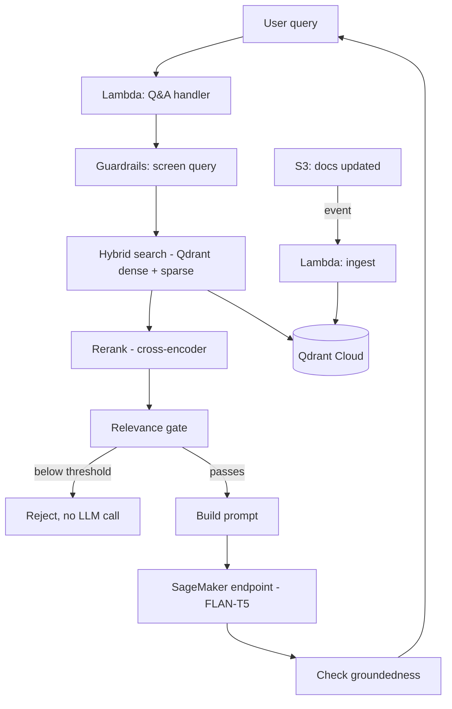

# RAG Chatbot — AWS Lambda & Serverless Q&A

A small RAG chatbot that answers questions about AWS Lambda & serverless, built on
Qdrant hybrid search, a SageMaker JumpStart model, and Lambda — fully provisioned with
Terraform.

## How it works



**Two paths:**
- **Q&A** — a query comes in, gets checked, retrieved against Qdrant (hybrid dense +
  sparse search), reranked, filtered by a relevance gate, then sent to the LLM. Low-
  relevance queries never reach the model.
- **Ingestion** — dropping a file in S3 automatically triggers re-embedding, so the
  knowledge base stays in sync without a manual reindex step.

Both Lambdas share one container image with different entrypoints.

## Stack

| Piece | Why |
|---|---|
| SageMaker (JumpStart, FLAN-T5) | Managed, auto-scaling inference endpoint with a prebuilt container — no custom serving code needed. |
| Qdrant hybrid search | Dense embeddings catch semantic meaning; sparse (BM25) catches exact terms embeddings blur (acronyms, resource names). Fused via RRF. |
| LangChain | Standardizes the SageMaker call + request/response handling. |
| Terraform | Provisions everything: S3, Lambdas, ECR, SageMaker, CloudWatch. |

Tunable pipeline settings (chunk size, thresholds, model names) live in one file:
`backend/config.yaml`.

## Quick start

```bash
cd rag_chatbot
python3 -m venv .venv && source .venv/bin/activate
pip install -r requirements.txt

export AWS_REGION="eu-central-1"
export QDRANT_URL="..."
export QDRANT_API_KEY="..."
export QDRANT_COLLECTION_NAME="aws_lambda_docs"

python scripts/resolve_jumpstart_metadata.py

cd terraform
terraform init
terraform apply   # SageMaker starts billing here, ~$1.90/hr
```

Test locally without a container:
```bash
python scripts/test_rag_local.py "What is a Lambda function URL?"
```

Or through the deployed endpoint:
```bash
curl -X POST "$(terraform output -raw qa_function_url)" \
  -H "Content-Type: application/json" \
  -d '{"query": "What is a Lambda function URL?"}'
```

Serve the frontend:
```bash
cd frontend && python -m http.server 8000
```

## Teardown

The SageMaker endpoint is the only real ongoing cost — delete it when you're done:
```bash
terraform destroy -target=aws_sagemaker_endpoint.this \
  -target=aws_sagemaker_endpoint_configuration.this \
  -target=aws_sagemaker_model.this
```
Full cleanup: `terraform destroy`.

## Cost

| Resource | Cost |
|---|---|
| SageMaker (ml.g5.2xlarge) | ~$1.90/hr, billed until deleted |
| Everything else (Lambda, S3, ECR, CloudWatch, Qdrant free tier) | ~$0 at this scale |

## Project structure

```
backend/     rag_core, guardrails, prompts, config, both Lambda handlers
terraform/   all infra
scripts/     local testing, JumpStart metadata, backfill reindex, metrics viewer
frontend/    single-file chat UI
```

## Known limitations

- Prompt-injection screening is regex-based, not a classifier.
- Q&A Function URL is public/unauthenticated — don't share it publicly.
- Single instance, no autoscaling or multi-AZ.

---
<details>
<summary>Implementation details (guardrails, metrics, ingestion internals)</summary>

**Guardrails** — two layers: Pydantic validates request shape before anything else runs;
`guardrails.py` handles content (injection screening, a two-tier relevance gate using raw
cosine similarity, and a groundedness check on the output that flags but doesn't block).
Every rejection is logged and emitted as a CloudWatch metric.

**Ingestion** — S3 events trigger re-embedding of just the changed file (not a full
rebuild), using `uuid5(source_file:chunk_index)` as point IDs so re-ingestion is
idempotent. `scripts/backfill_reindex_qdrant.py` handles full-collection rebuilds when
needed (model change, chunking change).

**Metrics** — CloudWatch tracks both standard resource metrics (latency, errors) and a
custom `RagChatbot/Quality` namespace (relevance/faithfulness scores, rejection counts by
type, ingestion success/failure).

**Prompt versioning** — grounded vs. weak-context templates live in `prompts.py` behind a
version string, so answer-quality shifts can be traced to specific prompt changes.

</details>
